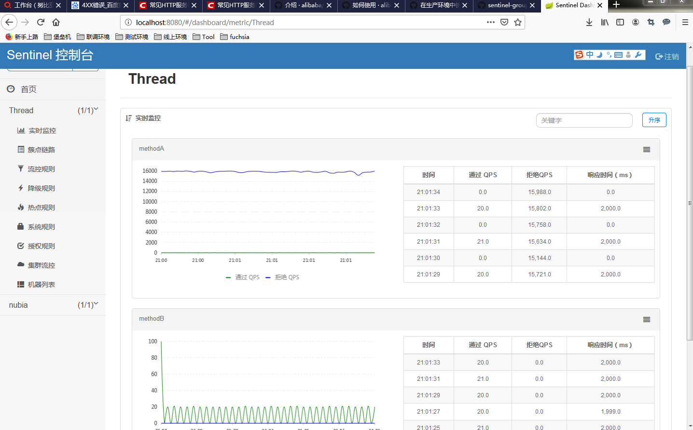
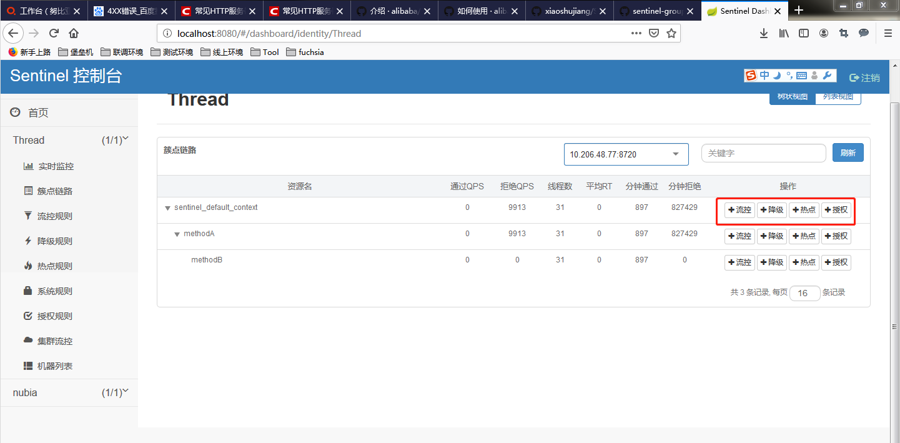
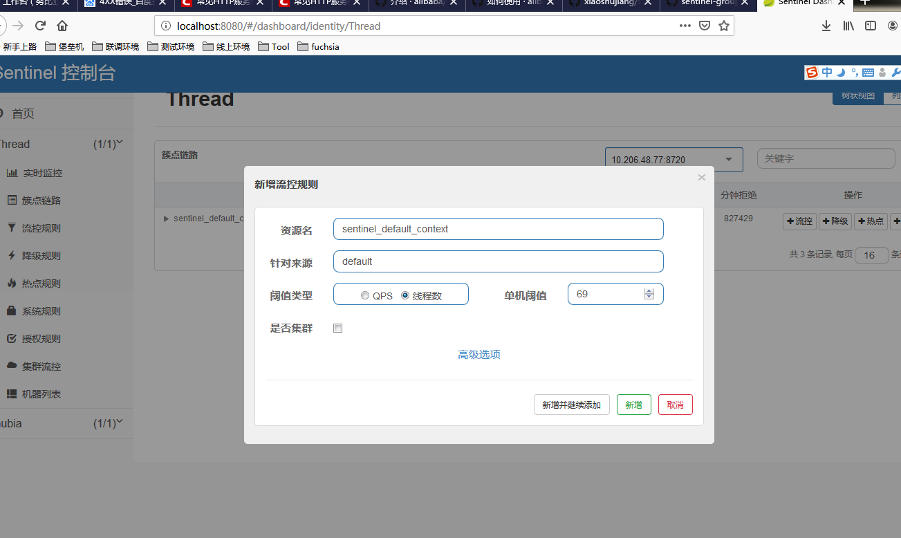
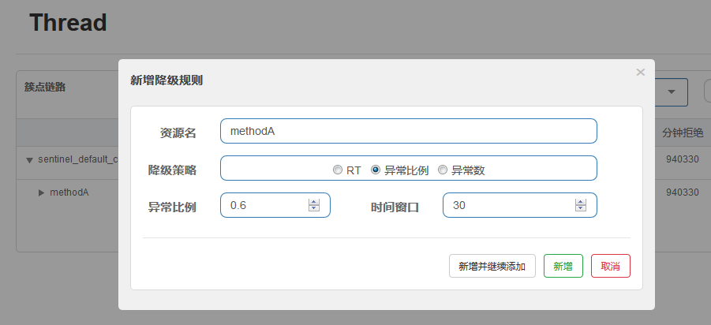
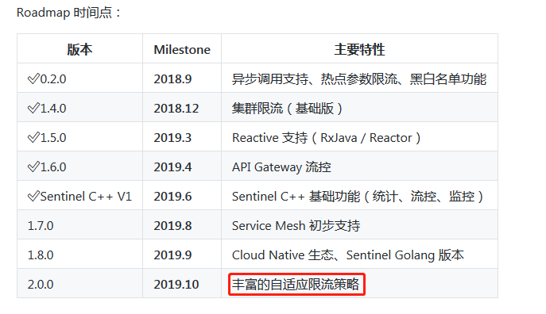

# 1.需要达成的目标
1. 接口数据QPS的实时统计
 春节期间应商店流量冲垮宕机，但是未捕获到峰值时期的接口的QPS数据，而Sentinel可以支持秒级的数据统计，只需要扩展相应的接口，将数据缓存到Redis中，
 然后持久化到MongDb或者Mysql中，就可以在事故发生后恢复崩溃前的实际请求
2. 对于日常接口请求，持久化后得到相应的数据，结合系统的CPU、内存占用量，可以设置对应的接口熔断降级指标
3. 对于调用外部的Elastic Search搜索，广告，私人定制，当错误率达到一定比例时，降级，确保主体功能可用

 1. Hystrix关注点
      隔离 和 熔断 为主的容错机制，超时或被熔断的调用将会快速失败，并可以提供 fallback 机制
 2. Sentinel关注点
    多样化的流量控制
    熔断降级
    系统负载保护
    实时监控和控制台
	承接了阿里巴巴近 10 年的双十一大促流量的核心场景，流控维度包括流控指标、流控效果（塑形）、调用关系、热点、集群等各种维度，针对系统维度也提供自适应的保护机制
 3. Resilience4j关注点
    Hystrix停更后的官方推荐方案
	轻量的熔断降级库
	使用较小较新的项目，缺乏生产级别的配套设施
	
由于Resilience4j缺乏生产级别的应用，本次调研只关注Sentinel、Hystrix，从如下几个方面展开：
- 是否能达成应用商店的目标
- 对代码的侵入程度
- 对已有业务的性能影响


# 2.Hystrix提供的能力

- 提供对延迟和故障的保护和控制，防止依赖项通过第三方客户端库访问（通常通过网络）。
- 停止复杂分布式系统中的级联故障。
- 故障迅速恢复。
- 在可能的情况下后退并优雅地降级。
- 启用近实时监视、警报和操作控制。

## 1.简单的可视化界面监控
1. 可视化的监控页面


2. 快速接入仪表盘
- 应用中心API、搜索等模块接入仪表盘maven库，可以看单个服务的监控数据
``` 
<dependency>
      <groupId>org.springframework.cloud</groupId>
      <artifactId>spring-cloud-starter-hystrix-dashboard</artifactId>
    </dependency>
	
/**
 * 测试步骤:
 * 1. 访问http://localhost:8030/hystrix.stream 可以查看Dashboard
 * 2. 在上面的输入框填入: http://想监控的服务:端口/hystrix.stream进行测试
 * 注意：首先要先调用一下想监控的服务的API，否则将会显示一个空的图表.
 * @author eacdy
 */
@SpringBootApplication
@EnableHystrixDashboard
public class HystrixDashboardApplication {
  public static void main(String[] args) {
    new SpringApplicationBuilder(HystrixDashboardApplication.class).web(true).run(args);
  }
}
```

3. Turebine数据聚合
- hystrix只能实现单个微服务的监控，可是一般项目中是微服务是以集群的形式搭建，一个一个的监控不现实。
- 而Turbine的原理是，建立一个turbine服务，并注册到eureka中，并发现eureka上的hystrix服务。通过配置turbine会自动收集所需hystrix的监控信息，最后通过dashboard展现，以达到集群监控的效果。


- 通过注册到注册中心，发现其他服务的hystrix服务，然后进行聚合数据，最后通过自身的端点输出到仪表盘上进行个性化展示。这我们就监控一个turbine应用即可
- 服务的集成
要想看多个系统或集群系统的Hystrix Dashboard数据就需要用到Hystrix Turbine。Hystrix Turbine将每个服务Hystrix Dashboard数据进行了整合

```  
<!-- turbine依赖 -->
<dependency>
    <groupId>org.springframework.cloud</groupId>
    <artifactId>spring-cloud-starter-netflix-turbine</artifactId>
</dependency>
<!-- eureka client依赖 -->
<dependency>
    <groupId>org.springframework.cloud</groupId>
    <artifactId>spring-cloud-starter-netflix-eureka-client</artifactId>
</dependency>

```


- 实心圆：它有颜色和大小之分，分别代表实例的监控程度和流量大小。如上图所示，它的健康度从绿色、黄色、橙色、红色递减。通过该实心圆的展示，我们就可以在大量的实例中快速的发现故障实例和高压力实例。
- 曲线：用来记录2 分钟内流量的相对变化，我们可以通过它来观察到流量的上升和下降趋势。


**接入参考**
[Hystrix监控面板及数据聚合](https://www.imooc.com/article/245586)
[Hystrix监控面板及数据聚合](https://www.cnblogs.com/chenweida/p/9025589.html)

3. 架构模式如下


**NOTE**
需要依赖Netflix的Eureka，用于服务注册发现、负载均衡和故障转移等，也是 SpringCloud 中使用的服务注册发现组件


NetFlix  停止更新维护从去年已经停止更新

## 2. 业务流程
1. 正常情况下服务之间会有很多的依赖调用


- 但当某个被服务不可用，或者负载太高时，会导致调用方大量线程阻塞，从而危及调用方的服务安全
- 可配置依赖调用超时时间,超时时间一般设为比99.5%平均时间略高即可.当调用超时时，直接返回或执行fallback逻辑。
- 提供熔断器组件,可以自动运行或手动调用,停止当前依赖一段时间(10秒)，熔断器默认错误率阈值为50%,超过将自动运行。


Hystrix将对外部系统（或“依赖项”）的所有调用包装到hystrixcommand或hystrixobservatablecommand对象中，一旦依赖项的错误率/超时时间超出设置的阈值，快速执行回退逻辑，避免服务之间的雪崩。


使用Fallback() 提供降级策略


2. 实现原理图
- 断路器模式
当某个服务单元发生故障（类似用电器发生短路）之后，通过断路器的故障监控（类似熔断保险丝），直接切断原来的主逻辑调用
- 三个重要参数：快照时间窗、请求总数下限、错误百分比下限。这个参数的作用分别是：
- 快照时间窗：断路器确定是否打开需要统计一些请求和错误数据，而统计的时间范围就是快照时间窗，默认为最近的 10 秒。
- 请求总数下限：在快照时间窗内，必须满足请求总数下限才有资格进行熔断。默认为 20，意味着在 10 秒内，如果该 Hystrix Command 的调用此时不足 20 次，即时所有的请求都超时或其他原因失败，断路器都不会打开。
- 错误百分比下限：当请求总数在快照时间窗内超过了下限，比如发生了 30 次调用，如果在这 30 次调用中，有 16 次发生了超时异常，也就是超过 50% 的错误百分比，在默认设定 50% 下限情况下，这时候就会将断路器打开。


断路器保持在开路状态一段时间后 (默认 5 秒)，自动切换到半开路状态 (HALF-OPEN)。这时会判断下一次请求的返回情况，如果请求成功，断路器切回闭路状态 (CLOSED)，否则重新切换到开路状态 (OPEN)。


3. Hystrix Metrics的实现
Hystrix的Metrics中保存了当前服务的健康状况, 包括服务调用总次数和服务调用失败次数等. 根据Metrics的计数, 熔断器从而能计算出当前服务的调用失败率, 用来和设定的阈值比较从而决定熔断器的状态切换逻辑 
Hystrix在这些版本中开始使用RxJava的Observable.window()实现滑动窗口原理如下：


## 3. 轻量级的代码接入

https://www.jianshu.com/p/b9af028efebb

``` 
<dependency>
  <groupId>com.netflix.hystrix</groupId>
  <artifactId>hystrix-core</artifactId>
  <version>1.5.8</version>
</dependency>

``` java
假设一个线程池大小为 8，等待队列的大小为 10。timeout 时长我们设置长一些，20s。
在 command 内部，写死代码，做一个 sleep，比如 sleep 3s。

withCoreSize：设置线程池大小
withMaxQueueSize：设置等待队列大小
withQueueSizeRejectionThreshold：这个与 withMaxQueueSize 配合使用，等待队列的大小，取得是这两个参数的较小值。


public class GetProductInfoCommand extends HystrixCommand<ProductInfo> {

    private Long productId;

    private static final HystrixCommandKey KEY = HystrixCommandKey.Factory.asKey("GetProductInfoCommand");

    public GetProductInfoCommand(Long productId) {
        super(Setter.withGroupKey(HystrixCommandGroupKey.Factory.asKey("ProductInfoService"))
                .andCommandKey(KEY)
                // 线程池相关配置信息
                .andThreadPoolPropertiesDefaults(HystrixThreadPoolProperties.Setter()
                        // 设置线程池大小为8
                        .withCoreSize(8)
                        // 设置等待队列大小为10
                        .withMaxQueueSize(10)
                        .withQueueSizeRejectionThreshold(12))
                .andCommandPropertiesDefaults(HystrixCommandProperties.Setter()
                        .withCircuitBreakerEnabled(true)
                        .withCircuitBreakerRequestVolumeThreshold(20)
                        .withCircuitBreakerErrorThresholdPercentage(40)
                        .withCircuitBreakerSleepWindowInMilliseconds(3000)
                        // 设置超时时间
                        .withExecutionTimeoutInMilliseconds(20000)
                        // 设置fallback最大请求并发数
                        .withFallbackIsolationSemaphoreMaxConcurrentRequests(30)));
        this.productId = productId;
    }

    @Override
    protected ProductInfo run() throws Exception {
        System.out.println("调用接口查询商品数据，productId=" + productId);

        if (productId == -1L) {
            throw new Exception();
        }

        // 请求过来，会在这里hang住3秒钟
        if (productId == -2L) {
            TimeUtils.sleep(3);
        }

        String url = "http://localhost:8081/getProductInfo?productId=" + productId;
        String response = HttpClientUtils.sendGetRequest(url);
        System.out.println(response);
        return JSONObject.parseObject(response, ProductInfo.class);
    }

    @Override
    protected ProductInfo getFallback() {
        ProductInfo productInfo = new ProductInfo();
        productInfo.setName("降级商品");
        return productInfo;
    }
}
```

# 3. Sentinel提供的能力


- 双十一零点持续峰值：限流、慢调用降级
-  秒杀（脉冲流量）：限流、慢调用降级
-  消息队列削峰填谷：MQ 消费端可能会出现大批量的消息同时到达，若瞬时请求所有消息会导致系统负载过高。我们利用匀速器模式将消息突刺均摊到一段时间内，让系统负载保持在处理能力水位的同时尽可能地处理更多消息，从而起到“削峰填谷”的效果。
-  冷启动：当流量突然增大的时候，系统从空闲状态到繁忙状态的切换的时间长一些，即如果系统在此之前长期处于空闲的状态，处理请求的速率缓慢增加，经过预期的时间以后，到达系统处理请求速率的设定值；
-  热点商品自动探测、防护：自动统计访问频次最高的热点参数并进行流量控制；
-  集群流量不均匀：通过集群限流来解决集群各个机器的流量不均导致整体限流效果不精确的问题；
- 支持 QPS、响应时间、限流数、异常数
- 轻量级、高性能、sentinel-core 没有任何多余依赖，打包后只有不到 200 KB

## 1.丰富的可视化控制台页面
1. 实时监控曲线


2. 完善的熔断降级策略

- 流量QPS/线程数控制

- 服务降级控制


3. 方便的集群数据汇总
- 应用中心的API、搜索等模块需要接入监控数据传输模块，将数据汇集到控制台

``` 
<dependency>
	<groupId>com.alibaba.csp</groupId>
	<artifactId>sentinel-transport-simple-http</artifactId>
</dependency>

```

- 应用中心的API、搜索等模块订阅控制台推送的规则，客户端实现 ReadableDataSource 接口端监听规则中心实时获取变更，流程如下：

支持扩展Redis 作为动态配置源使用时只需添加以下依赖：
``` 
<dependency>
    <groupId>com.alibaba.csp</groupId>
    <artifactId>sentinel-datasource-redis</artifactId>
    <version>x.y.z</version>
</dependency>

```

- 控制台发布推送规则，支持通过Redis发布推送规则，实现如下接口

``` 
DynamicRuleProvider<T>: 拉取规则
DynamicRulePublisher<T>: 推送规则

```
参考如果官方提供的sentinel-dashboard工程下test文件夹``` com.alibaba.csp.sentinel.dashboard.rule.zookeeper``` 的Demo


**一些常见建议**
[Sentinel相关问题](https://www.liangzl.com/get-article-detail-16677.html)

A:整个包不行,建议规则不需要一开始就定的，只要确认你埋好点就行，如果真的要整个包都埋点可以写个通过包名的拦截器规则

dubbo等是默认埋点的，可以任何时候需要的时候再制定规则
我们的建议是：不需要预先把所有的方法都配置好规则，一些重要的方法再配置规则，一个包里所有的方法都配上限流规则，这听起来不大"负责任"
流量监控和规则没关系，配不配规则监控上都看得到

## 2. 原理
在 Sentinel 里面，所有的资源都对应一个资源名称（resourceName），每次资源调用都会创建一个 Entry 对象。Entry 可以通过对主流框架的适配自动创建，也可以通过注解的方式或调用 SphU API 显式创建。Entry 创建的时候，同时也会创建一系列功能插槽（slot chain），这些插槽有不同的职责，例如:

- NodeSelectorSlot 负责收集资源的路径，并将这些资源的调用路径，以树状结构存储起来，用于根据调用路径来限流降级；
- ClusterBuilderSlot 则用于存储资源的统计信息以及调用者信息，例如该资源的 RT, QPS, thread count 等等，这些信息将用作为多维度限流，降级的依据；
- StatisticSlot 则用于记录、统计不同纬度的 runtime 指标监控信息；
- FlowSlot 则用于根据预设的限流规则以及前面 slot 统计的状态，来进行流量控制；
- AuthoritySlot 则根据配置的黑白名单和调用来源信息，来做黑白名单控制；
- DegradeSlot 则通过统计信息以及预设的规则，来做熔断降级；
- SystemSlot 则通过系统的状态，例如 load1 等，来控制总的入口流量；

### 1. 架构    


- Sentinel 将 SlotChainBuilder 作为 SPI 接口进行扩展，使得 Slot Chain 具备了扩展的能力。您可以自行加入自定义的 slot 并编排 slot 间的顺序，从而可以给 Sentinel 添加自定义的功能。


### 2. 高性能的滑动窗口算法
StatisticSlot 是 Sentinel 的核心功能插槽之一，用于统计实时的调用数据。


Sentinel 底层采用高性能的滑动窗口数据结构LeapArray 来统计实时的秒级指标数据，可以很好地支撑写多于读的高并发场景。

### 3. FlowSlot限流
这个 slot 主要根据预设的资源的统计信息，按照固定的次序，依次生效。如果一个资源对应两条或者多条流控规则，则会根据如下次序依次检验，直到全部通过或者有一个规则生效为止:

- 指定应用生效的规则，即针对调用方限流的；
- 调用方为 other 的规则；
- 调用方为 default 的规则。

### 4. DegradeSlot降级
这个 slot 主要针对资源的平均响应时间（RT）以及异常比率，来决定资源是否在接下来的时间被自动熔断掉。

### 5.SystemSlot系统负载动态调整
这个 slot 会根据对于当前系统的整体情况，对入口的资源进行调配。其原理是让入口的流量和当前系统的 load 达到一个动态平衡。

注意这个功能的两个限制:
- 只对入口流量起作用（调用类型为EntryType.IN），对出口流量无效。可通过 SphU.entry() 指定调用类型，如果不指定，默认是EntryType.OUT。

``` java
 Entry entry = SphU.entry("resourceName"，EntryType.IN);

```
- 只在 Unix-like 的操作系统上生效


## 3. 流量整形
当 QPS 超过某个阈值的时候，则采取措施进行流量控制。流量控制的手段包括以下几种：直接拒绝、Warm Up、匀速排队。对应 FlowRule 中的 controlBehavior 字段。
1. Warm Up预热/冷启动方式
当系统长期处于低水位的情况下，当流量突然增加时，直接把系统拉升到高水位可能瞬间把系统压垮。通过"冷启动"，让通过的流量缓慢增加，在一定时间内逐渐增加到阈值上限，给冷系统一个预热的时间，避免冷系统被压垮

基于令牌桶(Token bucket)实现，控制每秒的 QPS，即我们满足每秒通过的 QPS 即可，我们不需要关注每个请求的间隔。

我们用桶里剩余的令牌来量化系统的使用率。假设系统每秒的处理能力为 b,系统每处理一个请求，就从桶中取走一个令牌；每秒这个令牌桶会自动掉落b个令牌。令牌桶越满，则说明系统的利用率越低；当令牌桶里的令牌高于某个阈值之后，我们称之为令牌桶"饱和"。


2. 匀速排队
严格控制请求通过的间隔时间，也即是让请求以均匀的速度通过，对应的是漏桶算法  
这种方式主要用于处理间隔性突发的流量，例如消息队列。想象一下这样的场景，在某一秒有大量的请求到来，而接下来的几秒则处于空闲状态，我们希望系统能够在接下来的空闲期间逐渐处理这些请求，而不是在第一秒直接拒绝多余的请求。


请求先进入到漏桶里，漏桶以一定的速度出水，当水请求过大会直接溢出，可以看出漏桶算法能强行限制数据的传输速率


## 4. 自适应保护
阿里规划10月份会有丰富的自适应限流策略


# 对代码的侵入程度

| Sentinel  | Hystrix | 
| ---------------------------------------------------------------------------------------------------------------------------------------- | ------- |
| 限流、熔断接口用注解：
@SentinelResource(value = "test", blockHandler = "handleException", blockHandlerClass = {ExceptionUtil.class}) |    注解 @HystrixCommand    | 


# 对已有业务的性能影响

| Sentinel | Hystrix |
| -------- | ------- |
|     单机25w qps以下基本没啥影响 超过了这个值会有一个比较明显的5%-10%d的下降     |    300并发无影响       |
|          |    Netflix API 每天通过 Hystrix 执行 10 亿次调用，每个服务实例有 40 个以上的线程池，每个线程池有 10 个左右的线程。）最后发现说，用 Hystrix 的额外开销，就是给请求带来了 3ms 左右的延时，最多延时在 10ms 以内，相比于可用性和稳定性的提升，这是可以接受的

参考:
[Hystrix官方压测数据](https://github.com/Netflix/Hystrix/wiki/How-it-Works)

# Sentinel、Hystrix、Resilience4j功能比较
[限流熔断技术选型：从Hystrix到Sentinel](https://www.sohu.com/a/282806665_268033)

|  	| Sentinel | 	Hystrix |  Resilience4j |
| -------- | ---------- | ------- | ------- |
| 隔离策略 | 信号量隔离（并发线程数限流） |	线程池隔离/信号量隔离  | 信号量隔离 |
| 熔断降级策略  | 	基于响应时间、异常比率、异常数  |  基于异常比率、响应时间 |
| 实时指标实现 |	滑动窗口（LeapArray）   | 	滑动窗口（基于 RxJava）  | Ring Bit Buffer |
| 规则配置   | 	支持多种数据源  | 	支持多种数据源  | 有限支持 | 
| 扩展性  | 	多个扩展点  | 	插件的形式  | 接口的形式 |
| 基于注解的支持  | 	支持  | 	支持  |	支持  |
| 常见框架的适配  | 	Servlet、Spring Cloud、Dubbo、gRPC 等  | 	Servlet、Spring Cloud Netflix  |
| **限流**  | 	基于 QPS，支持基于调用关系的限流  | 	有限的支持  | Rate Limiter |
| **流量整形**  | 	支持慢启动、匀速器模式  | 	不支持  | 简单的 Rate Limiter 模式 |
| **系统自适应保护**  | 	支持 | 不支持  |  不支持 |
| **控制台**  | 	开箱即用，可配置规则、查看秒级监控、机器发现等  | 	简单的监控查看  | 不提供控制台，可对接其它监控系统 |
| 收欢迎程度 |      Star:8428 Fork:2442 2019/8/26最后一次代码体检   |       Star:18119 Fork:3729  2018/10/20最后一次代码体检     |  Star:4121 Fork:490 2019/8/26最后一次代码体检  |
| 开源公司 | 阿里  双11  | NetFlix  停止更新维护 |  缺乏生产级别的配套设施 |

**结论**
由于Sentinel提供了更加丰富的可视化平台，拥有丰富的限流策略，能对突发的流量做整形，且经受到阿里的双十一流量洪峰的考验，选择使用Sentinel作为应用商店服务稳定性保障的技术

# 参考资料
```
  https://github.com/all4you/sentinel-tutorial
  https://github.com/alibaba/Sentinel
  https://github.com/Netflix/Hystrix/
  https://www.jianshu.com/p/a52bf4073873
  
```
    
# 接入文档

1. Dash接入Zookeeper持久化限流规则

application.properties

``` 
zookeeper.host=10.47.95.68 
分别修改为local,test,dev,formal,stress的zookeeper的ip

```

限流zookeeper持久化
sidebar.html
```html
 <!-- modify by hxf -->
  <li ui-sref-active="active" ng-if="!entry.isGateway">
    <a ui-sref="dashboard.flow({app: entry.app})">
      <i class="glyphicon glyphicon-filter"></i>&nbsp;&nbsp;流控规则</a>
  </li>
```

identity.js
``` javascript
app.controller('IdentityCtl', ['$scope', '$stateParams', 'IdentityService',
  'ngDialog', '***FlowServiceV2***', 'DegradeService', 'AuthorityRuleService', 'ParamFlowService', 'MachineService',
  '$interval', '$location', '$timeout',
```


1. Dash控制台启动参数设置

``` 
java -Dserver.port=8080 -Dcsp.sentinel.dashboard.server=localhost:8080 -Dproject.name=sentinel-dashboard -Dcsp.sentinel.log.dir=D:\\idea-source\\sentinel-logs  -jar sentinel-dashboard-1.6.3.jar
```

```
-Dserver.port=8080 -Dcsp.sentinel.dashboard.server=localhost:8080 -Dproject.name=sentinel-dashboard

java -Dserver.port=8080 -Dcsp.sentinel.dashboard.server=localhost:8080 -Dproject.name=sentinel-dashboard -jar sentinel-dashboard.jar
```

2. 普通Spring MVC/Boot启动参数设置
`` java
-Dserver.port=9090 -Dcsp.sentinel.dashboard.server=localhost:8080 -Dproject.name=springaop
-Dcsp.sentinel.app.type=1 启动参数以将您的服务标记为 API Gateway，在接入控制台时您的服务会自动注册为网关类型，然后您即可在控制台配置网关规则和 API 分组
```

4. Spring MVC接入Zookeeeper
4.1 多个节点如何接入控制台，共享限流参数
目前发现同一个Spring MVC通过两个端口启动两份，第二次启动无法限流成功

5. 多个Spring MVC节点接入Zookeeeper


6. 压测数据对比


7. 常见异常

``` 
1.启动报错 Could not initialize class com.alibaba.csp.sentinel.context.ContextUtil
 检查zookeeper jar版本，如果3.3.x，改为：3.4.14
2.[ZookeeperDataSource] WARN: initial config is null, you may have to check your data source
 资源配置不生效，将fastjson版本升到1.2.56
 
```

curatorFrameworkImpl background retry gave up的异常是因为版本兼容问题，参考
[版本兼容问题](http://curator.apache.org/zk-compatibility.html)
```
<dependency>
    <groupId>org.apache.curator</groupId>
    <artifactId>curator-recipes</artifactId>
    <version>${curator-version}</version>
    <exclusions>
        <exclusion>
            <groupId>org.apache.zookeeper</groupId>
            <artifactId>zookeeper</artifactId>
        </exclusion>
    </exclusions>
</dependency>
```
